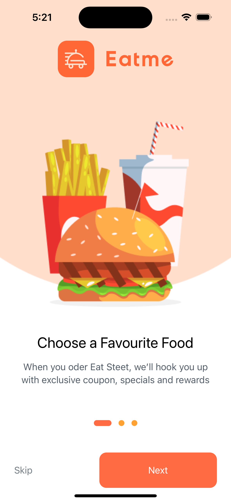
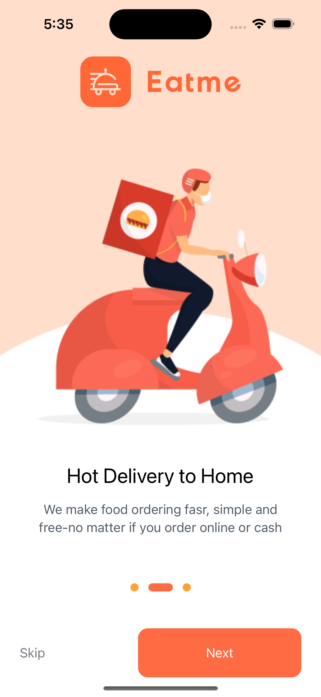
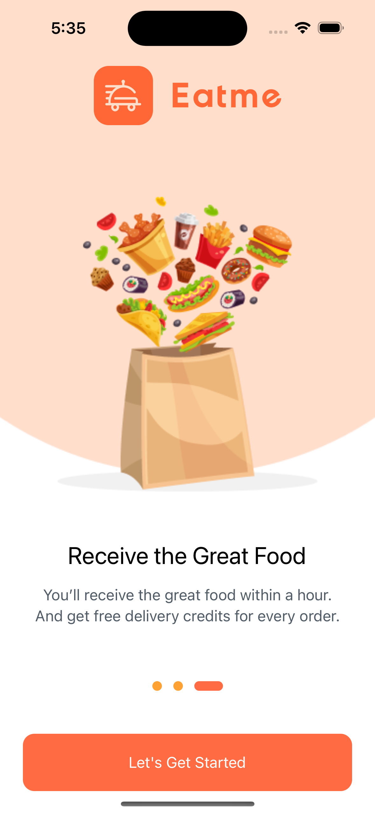
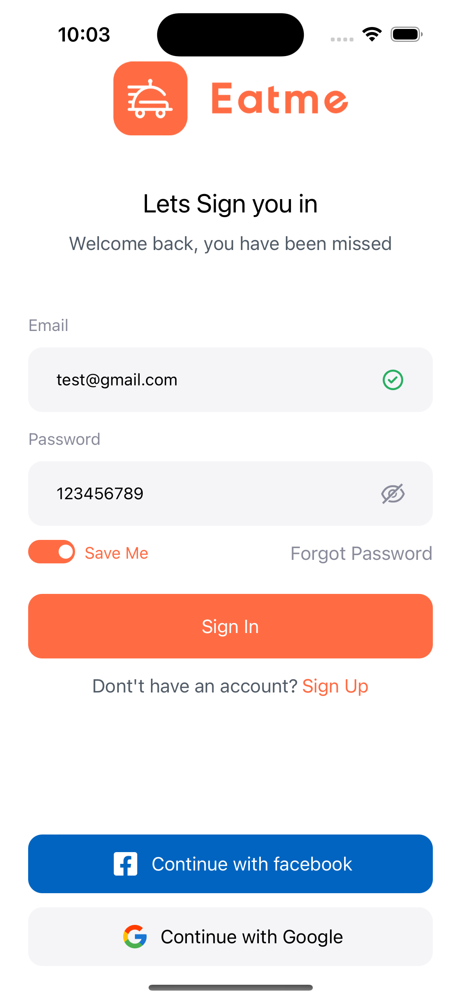
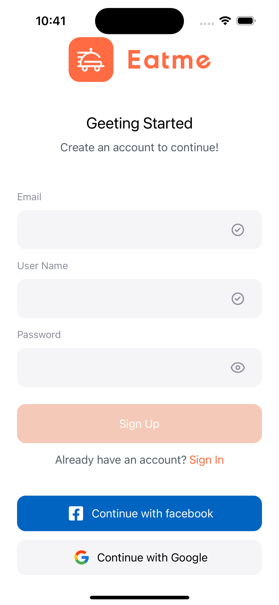
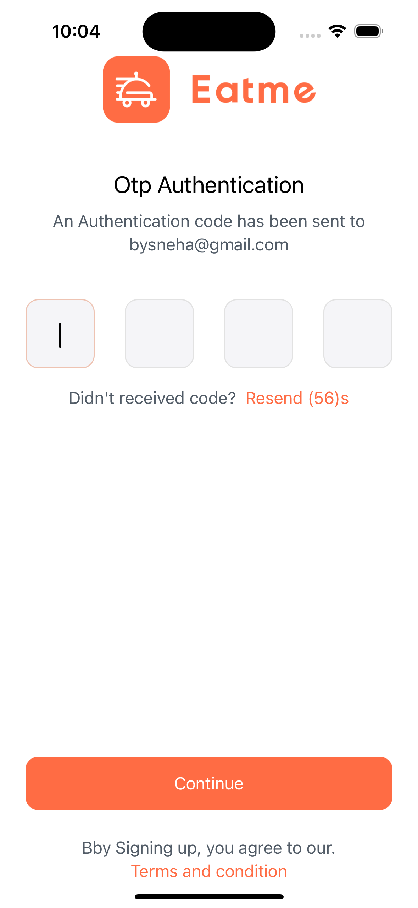
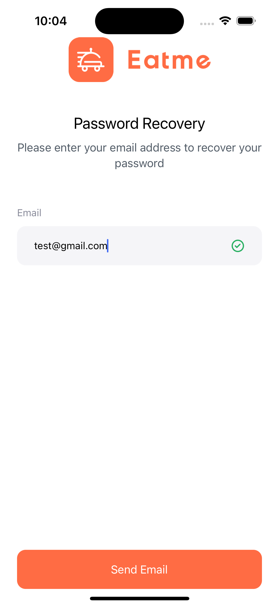
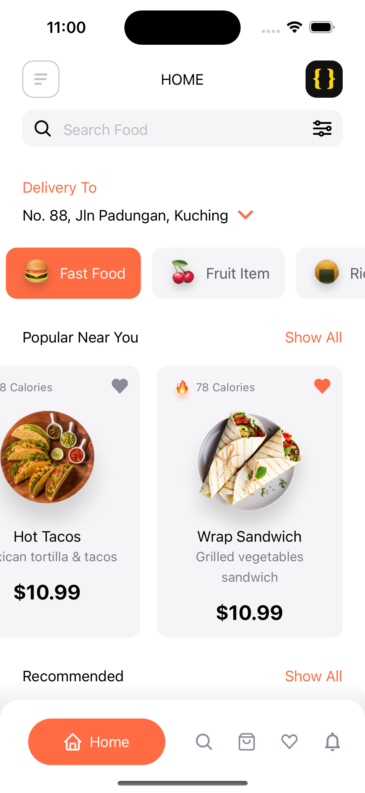
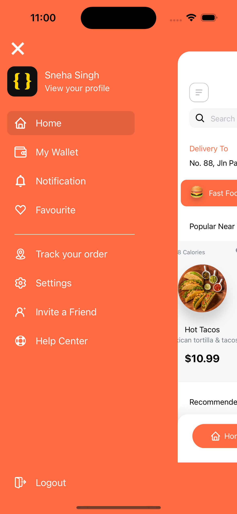
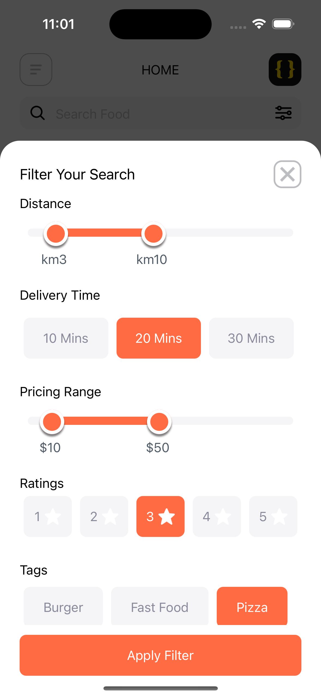

This is a new [**React Native**](https://reactnative.dev) project, bootstrapped using [`@react-native-community/cli`](https://github.com/react-native-community/cli).

# Food Delivery App

> **Note**: The Food Delivery App allows users to easily order food and includes features such as My Wallet, Notifications, Favorites, Order Tracking, Settings, Invite a Friend, Help Center, and Logout. Upon opening the app, users are greeted with an **onboarding screen** offering a Next and Skip option. By clicking Next, users can preview the app’s key features before reaching the **Authentication screen** (Sign In, Sign Up, OTP, Forgot Password), depending on their login status. New users can explore the full onboarding experience, while existing users may skip it to navigate directly to the main or authentication screen. Within the app, users can explore food options like Popular Near You, Trending Food, and Recommended Food, along with viewing details such as distance, ratings, delivery time, and tags.

## Step 1: Start the Metro Server

To start Metro, run the following command from the _root_ of your React Native project:

```bash
# using npm
npm start

# OR using Yarn
yarn start
```

## Step 2: Start your Application

Let Metro Bundler run in its _own_ terminal. Open a _new_ terminal from the _root_ of your React Native project. Run the following command to start your _Android_ or _iOS_ app:

### For Android

```bash
# using npm
npm run android

# OR using Yarn
yarn android
```

### For iOS

```bash
# using npm
npm run ios

# OR using Yarn
yarn ios
```

If everything is set up _correctly_, you should see your new app running in your _Android Emulator_ or _iOS Simulator_ shortly provided you have set up your emulator/simulator correctly.

This is one way to run your app — you can also run it directly from within Android Studio and Xcode respectively.

## Step 3: Modifying your App

Now that you have successfully run the app, let's modify it.

1. Open `App.tsx` in your text editor of choice and edit some lines.
2. For **Android**: Press the <kbd>R</kbd> key twice or select **"Reload"** from the **Developer Menu** (<kbd>Ctrl</kbd> + <kbd>M</kbd> (on Window and Linux) or <kbd>Cmd ⌘</kbd> + <kbd>M</kbd> (on macOS)) to see your changes!

   For **iOS**: Hit <kbd>Cmd ⌘</kbd> + <kbd>R</kbd> in your iOS Simulator to reload the app and see your changes!

## Congratulations! :tada:

You've successfully run and modified your React Native App. :partying_face:

### Technology Stack

- [React-Native] - For a rich UI across both Android and iOS (version 0.75.4).
- [Navigation] - Drawer-tabs bavigation (v6.7.2) and stack navigation (v6.4.1).
- [React-Redux] - for State management using @reduxjs/toolkit (v2.3.0), react-redux (v9.1.2)
- [Multi-slider] - react-native-multi-slide (v0.3.6). for sider to see distance and price range.
- [Otp-Input] - @twotalltotems/react-native-otp-input (v1.3.11). for OTP Input Box
- [Javascript] - For implementing logic.
- [git-hub] - For code version control.

### Features

- Dynamic Drawer Animation.
- Bottom Tabs Animation(without 3rd party plugin)
- Dynamic Filter bottom Modal with animation (without 3rd party plugin)
- Home: Dynamic top bar tabs that adjust based on text width, with animation used in the FlatList.
- Splash screen implimented
- dynamic custome onbbboarding screen (for intro abbout application)

## APK File for Testing:

Download the APK file here:

# Screenshots of the app:

 --- 
 <br><br> 
 --- 
 &nbsp;&nbsp;&nbsp;&nbsp;   &nbsp;&nbsp;&nbsp;&nbsp;
 &nbsp;&nbsp;&nbsp;&nbsp; 
